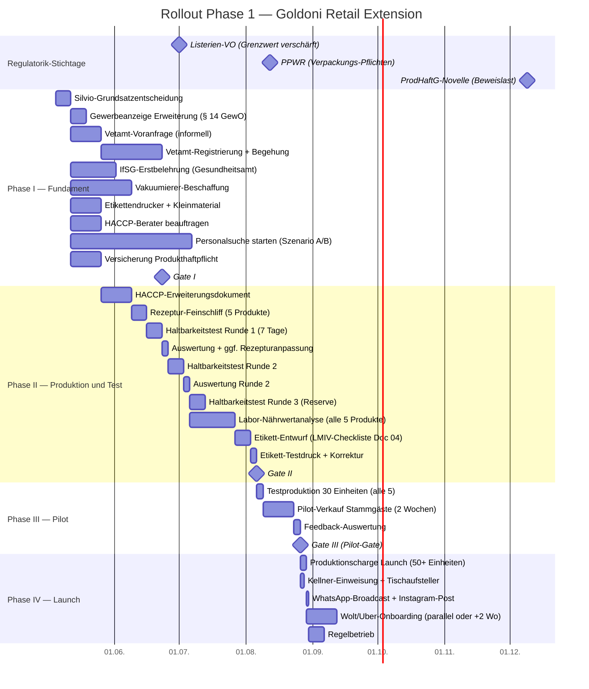

# Doc 13 — Rollout-Plan und Meilensteine

> **Version:** v2 (2026-04-13, Session 14)
> **Basis:** `docs/plans/rollout-plan.md` (strategischer 7-Schritte-Plan), 17 Findings aus CFO-Lead-Review + Co-Reviews Thomas (Gastronom) + Dr. Steiger (Lebensmittelrechtler).
> **Findings aufgelöst:** F-01 bis F-17 (alle 17). Siehe `docs/findings/13-findings-rollout.md`.
> **Scope:** Phase 1 — Vakuum, gekühlt, 5 Produkte, Abholung + Plattform-Lieferung. Kein Tiefkühl (D-02).
> **Abhängigkeit:** Dieses Dokument ist der operative Ausführungsplan zu `rollout-plan.md` (Strategie), nicht dessen Ersatz.

## Kernparameter

| Parameter | v1 (veraltet) | v2 |
|---|---|---|
| Timeline | 6 Wochen | **10–12 Wochen** (Worst Case 14–16 bei Iteration) |
| Struktur | Wochen-basiert, linear | **4 Phasen, gate-basiert** |
| Produkte zum Start | 2 (Lasagne + Ragù) | **5** (2x Lasagne, Ragù, Sugo, Parmigiana) |
| Pilot-Gate | keines | **explizit, quantifizierte Abbruchkriterien** |
| Budget | keines | **pro Phase, verknüpft mit Doc 02 v2** |
| Regulatorische Stichtage | nicht erwähnt | **3 Stichtage als fixe Meilensteine** |
| Personal-Meilenstein | keiner | **Misch-Modell M, Suche ab Woche 1–2** |

## Vier Phasen im Überblick

| Phase | Name | Dauer | Gate am Ende |
|---|---|---|---|
| **I** | Fundament (Behörden, Beschaffung, Personal-Start) | Woche 1–4 | Vetamt-Voranfrage positiv, Geräte bestellt |
| **II** | Produktion & Test (Rezeptur, MHD, Labor) | Woche 3–8 | Mindestens 3 von 5 Produkten tragen 7 Tage, Laborergebnisse da |
| **III** | Pilot (begrenzter Verkauf an Stammgäste) | Woche 8–10 | Pilot-Gate bestanden (siehe Abbruchkriterien) |
| **IV** | Launch (Regelbetrieb) | ab Woche 10–12 | — |

Phasen überlappen teilweise (II startet in Woche 3, während I noch läuft). Das ist gewollt — der kritische Pfad wird durch Parallelisierung verkürzt.

## Gantt-Diagramm



**Hinweis:** Die konkreten Daten im Gantt sind Platzhalter (Start 05.05.2026). Der tatsächliche Start hängt von Silvios Grundsatzentscheidung ab (SP-13 Launch-Timing). Die relativen Dauern und Abhängigkeiten sind fix.

## Phase I — Fundament (Woche 1–4)

### Woche 1 — Behörden-Kickoff und Beschaffung starten

**Silvio-Grundsatzentscheidung:**
- Silvio bestätigt: "Ja, ich will das machen." Ohne dieses Ja startet nichts. (Gate nach Schritt 1, `rollout-plan.md`)
- Launch-Timing-Entscheidung (SP-13): vor oder nach 12.08.2026 (PPWR)? Siehe Hand-Out `docs/silvio-paket/sp-13-launch-timing-entscheidung.md`.

**Behörden (parallel starten):**

| # | Aktion | Kontakt | Dauer | Kosten | Referenz |
|---|---|---|---|---|---|
| 1 | Vetamt Stuttgart anrufen — Sachverhalt schildern, Registrierungsbedarf klären, Unterlagenliste anfordern | **0711 21688590**, Online-Registrierung über **service-bw.de** | Erstkontakt 1–2 Wochen, Registrierung + Begehung 4–6 Wochen | Gebühren [TBD-Recherche], Schätzung 150–400 € | SP-01 |
| 2 | Gewerbeanzeige erweitern (§ 14 GewO): "Einzelhandel mit Lebensmitteln" zusätzlich zur Gaststättenerlaubnis | Gewerbeamt Stuttgart | 1 Woche | 15–60 € | SP-03 |
| 3 | IfSG-Erstbelehrung (§ 43 IfSG) für alle Personen mit Lebensmittelkontakt: Silvio + ggf. Ehefrau + ggf. externe Kraft | Gesundheitsamt Stuttgart, Termin-Vorlauf 2–4 Wochen | Halber Tag pro Person | 25–30 €/Person | SP-04 |
| 4 | IHK Stuttgart Gastronomie-Erstberatung (kostenlos) — Risiko-Check vor Vetamt-Einreichung | 0711 2005-0 | 1 Termin | 0 € | SP-02 |

**Beschaffung (parallel zu Behörden):**

| # | Aktion | Dauer | Kosten | Referenz |
|---|---|---|---|---|
| 5 | Vakuumierer: 2–3 Angebote einholen, bestellen. Silvio hat einen Henkelman im Bestand — Typ, Alter, Kammer-Größe klären [TBD-Silvio]. Falls ausreichend, entfällt Neukauf. | 2–6 Wochen Lieferzeit (Neugerät) | 1.500–3.500 € (Neugerät) oder 0 € (Bestand reicht) | Doc 12 v2 |
| 6 | Etikettendrucker (Brother QL-820NWB o.ä.) + Vakuumbeutel (Allfo, 500er-Pack) + Waage | 1–2 Wochen | 300–600 € | — |
| 7 | HACCP-Berater beauftragen (IHK-Empfehlung oder lokaler Lebensmittelberater) | 1–2 Wochen bis Beauftragung | 500–1.500 € [TBD-Recherche] | SP-09 |

**Personal (Misch-Modell M, Doc 20 v2):**

Personalsuche startet in **Woche 1–2**, nicht nach dem Pilot. Suchdauer Stuttgart: 4–8 Wochen. Das heißt: wenn Silvio in Woche 7 aus Szenario C in A oder B wechseln will, muss die Person gefunden und IfSG-belehrt sein. Parallel-Stream, nicht Folge-Schritt.

| Szenario | Aktion in Woche 1 |
|---|---|
| A (Ehefrau) | IfSG-Belehrung buchen, Ehegatten-AV-Entwurf beim Steuerberater anfragen |
| B (externe Kraft) | Stellenanzeige IHK-Jobbörse / Arbeitsagentur / informelle Kanäle |
| C (Silvio selbst, Pilot) | Nichts — aber Suche für A/B trotzdem starten |

**Versicherung:**

| # | Aktion | Dauer | Kosten |
|---|---|---|---|
| 8 | Produkthaftpflicht-Versicherung anfragen (2–3 Angebote). ProdHaftG-Novelle ab 09.12.2026 verschärft die Haftung — Versicherung ist kein Nice-to-have. | 1–2 Wochen | 300–800 €/Jahr [TBD-Recherche] |

### Gate I (Ende Woche 4)

| Kriterium | Bestanden wenn... | Fail-Aktion |
|---|---|---|
| Vetamt-Voranfrage | "grundsätzlich machbar" oder "machbar mit Auflagen X" | Küchen-Umbau > wirtschaftliche Schwelle → Stopp oder Scope-Reduktion |
| Geräte | bestellt oder Bestand geprüft und ausreichend | Lieferzeit > 6 Wochen → Timeline-Korrektur |
| IfSG | Termin gebucht oder bereits belehrt | Ohne IfSG kein legaler Produktionsstart |
| Personalsuche | gestartet (A: AV-Entwurf, B: Anzeige geschaltet) | Verzögerung bedeutet Dauer-Szenario-C-Risiko |

## Phase II — Produktion und Test (Woche 3–8)

Phase II startet überlappend mit Phase I (Woche 3), sobald der Vakuumierer geliefert ist oder der vorhandene Henkelman geprüft und einsatzbereit ist.

### HACCP-Erweiterung (Woche 3–4)

- HACCP-Berater erstellt Erweiterungsdokument gemeinsam mit Silvio (1 Tag vor Ort)
- CCPs für Vakuum-Produktionsprozess definieren:
  - **CCP 1:** Abkühlung nach Garung (Kerntemperatur < 10 °C innerhalb 90–120 Minuten, nicht 45 Minuten wie in v1 angenommen)
  - **CCP 2:** Vakuumieren bei < 4 °C Produkttemperatur
  - **CCP 3:** Lagerung 0–4 °C durchgehend
- Chargenprotokoll-Vorlage anlegen
- Tagesprotokoll Kühlung drucken und an Kühlschrank hängen

### Rezeptur-Tests und Haltbarkeits-Validierung (Woche 4–7)

**Produkte (5 Stück, Doc 02 v2):** Lasagne Classica, Lasagne Verdure, Ragù Bolognese, Sugo Pomodoro, Parmigiana di Melanzane.

**Haltbarkeitstests brauchen Iterationen** (Thomas CF-02). Eine Testrunde reicht nicht. Der Ablauf pro Runde:

| Tag | Aktion |
|---|---|
| Tag 0 | Produktion (vormittags 9–14 Uhr), Abkühlung dokumentieren, Vakuumieren, Etikettieren mit Charge + Datum |
| Tag 1–6 | Tägliche Sichtkontrolle: Beutel-Aufwölbung, Verfärbung, Geruch |
| Tag 7 | Verkostung: Textur, Geschmack, Wasserabscheidung, Geruch. Bewertung: Bestanden / Nicht bestanden / Grenzwertig |

**Iteration-Loops:**

| Runde | Timing | Zweck |
|---|---|---|
| Runde 1 | Woche 4–5 | Baseline: Welche Produkte tragen 7 Tage? |
| Runde 2 | Woche 5–6 | Korrektur: Rezepturanpassung (z.B. Wasseranteil Parmigiana, Fett-Austritt), erneuter 7-Tage-Test |
| Runde 3 (Reserve) | Woche 6–7 | Nur falls Runde 2 für ein Produkt nicht bestanden |

**Worst Case:** Wenn ein Gericht nach 3 Runden nicht 7 Tage trägt → Haltbarkeit auf 5 Tage verkürzen (angepasste Preislogik) oder Gericht streichen. Mindestens 3 von 5 Produkten müssen 7 Tage bestehen.

**Pietro-Hinweise (Küchenchef Co-Review):**
- Produktionsreihenfolge: Sugo → Ragù → Lasagne → Parmigiana (Aufbaukomplexität)
- Mise-en-Place für 5 Produkte: 8–12 h/Woche reine Arbeitszeit (ohne Abkühlzeit)
- Parmigiana: Fett-Austritt beim Vakuumieren testen (Beutel-Robustheit)
- 3-Produkt-Rotation als Backup, falls 5 im Pilot zu viel: Classica + Sugo + Ragù

### Labor-Nährwertanalyse (Woche 6–8)

**Keine fddb.info.** Online-Nährwertrechner reichen nicht für Verkaufs-Etiketten. Musterwerte sind ein sofortiger Ablehnungsgrund (Doc 04 Co-Review Behördenkontrolleur).

| Aktion | Dauer | Kosten |
|---|---|---|
| Proben aller 5 Produkte ans Labor senden (alle parallel!) | Einsendung 1 Tag | Versandkosten |
| Laboranalyse (Nährwerte + Mikrobiologie) | **2–3 Wochen** Durchlaufzeit | 80–150 € pro Produkt = **400–750 € gesamt** |
| Ergebnisse in Etikett-Entwurf übernehmen | 1 Tag | — |

Labore: SGS, Eurofins, TÜV Süd, oder über IHK/HACCP-Berater empfohlen. Alle 5 Produkte parallel einsenden — seriell wäre 10–15 Wochen.

### Etikett-Entwurf (Woche 7–8)

Erst **nach** Laborergebnissen, weil Nährwerte Pflichtangabe sind (LMIV). Entwurf in Canva oder vergleichbarem Tool, aber zwingend gegen die **LMIV-Pflicht-Checkliste** (Doc 04 v2) validiert:

| # | Pflichtangabe | Check |
|---|---|---|
| 1 | Bezeichnung des Lebensmittels | |
| 2 | Zutatenverzeichnis (Allergene fett) | |
| 3 | Nettofüllmenge (g) | |
| 4 | Mindesthaltbarkeitsdatum | |
| 5 | Name und Anschrift Hersteller | |
| 6 | Nährwertdeklaration (Big 7, Laborwerte) | |
| 7 | Aufbewahrungshinweis ("bei 2–4 °C lagern") | |
| 8 | Aufwärm-Anleitung | |
| 9 | Los-/Chargennummer | |
| 10 | Herkunftsangabe (falls relevant) | |
| 11 | Mindestschriftgröße 1,2 mm (x-Höhe) | |

Name auf dem Etikett: **Silvio Brunetti**, Ristorante Goldoni, Reinsburgstraße [TBD-Silvio Hausnr.], [TBD-Silvio PLZ] Stuttgart (SP-09).

### Gate II (Ende Woche 8)

| Kriterium | Bestanden wenn... | Fail-Aktion |
|---|---|---|
| Haltbarkeit | Mindestens 3 von 5 Produkten tragen 7 Tage sensorisch + mikrobiologisch | Nicht-bestandene Produkte streichen oder MHD verkürzen |
| Laborergebnisse | Nährwerte und Mikrobiologie liegen vor | Kein Etikett druckbar → kein Pilot |
| Etiketten | LMIV-konform, testgedruckt, lesbar | Korrekturschleife (1 Woche Puffer) |
| Vetamt-Registrierung | Bestätigung eingegangen oder Erstbegehung terminiert | Launch ohne Registrierung = illegal |
| IfSG | Alle produzierenden Personen belehrt | Ohne IfSG kein legaler Produktionsstart |
| HACCP | Erweiterungsdokument fertig, Protokolle bereit | Vetamt-Erstbegehung scheitert ohne HACCP |

## Phase III — Pilot (Woche 8–10)

### Testproduktion (Woche 8, 1 Tag)

- 30 Einheiten produzieren (alle 5 Produkte, je 6 Stück)
- Gesamter Prozess protokolliert: Zeiten, Temperaturen, Chargen-Nummern
- Etiketten mit echten Laborwerten gedruckt

### Pilot-Verkauf (Woche 8–10, 2 Wochen)

Verkauf ausschließlich an Stammgäste im Restaurant. Kein Wolt, kein Uber, kein Webshop. Begrenztes Volumen (30–50 Einheiten/Woche).

**Feedback-Erfassung:** Kellner fragen aktiv nach ("Haben Sie es probiert? Wie war's?"). Silvio notiert: Produkt, Feedback-Tendenz (positiv/neutral/negativ), Nachkauf-Signal (ja/nein), Beschwerden.

### Gate III — Pilot-Gate (Ende Woche 10)

**Quantifizierte Abbruchkriterien** (Thomas CF-03):

| Kriterium | Bestanden | Iteration nötig | Stopp |
|---|---|---|---|
| Nachkauf-Rate | > 50 % der Erstkäufer kaufen nach | 30–50 % — Feedback auswerten, Produkt anpassen | < 30 % — grundlegendes Produktproblem |
| Beutel-Schäden | 0 von 50 Beuteln | 1–2 von 50 — Beutel-Lieferant/Vakuum-Einstellung prüfen | > 2 von 50 — Prozess unsicher |
| Ausschuss-Rate Produktion | < 10 % | 10–20 % — Prozess optimieren | > 20 % — Produktion nicht stabil |
| Reklamationen Geschmack/Textur | < 10 % der Kunden | 10–20 % — Rezeptur-Iteration | > 20 % — Produkt nicht marktfähig |
| Aufwärm-Ergebnis | Kunden schaffen es ohne Hilfe | Aufwärm-Anleitung verbessern | — (kein Stopp, nur Iteration) |

**Iteration:** Wenn Pilot-Gate "Iteration nötig" ergibt → 1–2 Wochen Korrektur, dann zweiter Pilot-Lauf (Woche 11–12). Maximal ein Iterations-Loop.

## Phase IV — Launch (ab Woche 10–12)

### Launch-Vorbereitung (2–3 Tage)

| # | Aktion | Wer |
|---|---|---|
| 1 | Produktionscharge: 50+ Einheiten (Mix nach Pilot-Erfahrung) | Silvio / Produktionskraft |
| 2 | Kellner-Einweisung: Skript (Doc 09), Preise, Aufwärm-Tipps | Silvio |
| 3 | Tischaufsteller platzieren | Silvio |
| 4 | Preis ins Kassensystem eintragen (TSE-Prüfung: SP-06) | Silvio |
| 5 | WhatsApp-Broadcast an Stammkunden | Silvio |
| 6 | Instagram-Post (Produktion, Produkte) | Silvio |

### Wolt/Uber-Onboarding (Launch +1–2 Wochen)

Nicht am Tag 1, sondern nach 1–2 Wochen stabilem Abholverkauf. Onboarding-Prozess (Doc 09 v2):

- Wolt/Uber-Eats Partner-Anmeldung (1–2 Wochen Freischaltung)
- Übergabe-Protokoll (Bruno Co-Review): Beutel in Papiertüte, Temperatur-Indikator, keine Stoß-Empfindlichkeit
- Plattform-Preis: max. +2 € über Restaurant-Preis (Provisions-Ausgleich)

### Regelbetrieb

- Wöchentliche Produktions-Routine (Doc 10 v2: 5-Produkt-Zeitstrahl, Delegierbarkeits-Matrix)
- Chargen-Protokolle lückenlos
- Verkaufszahlen und Feedback dokumentieren (Woche für Woche, mindestens 4 Wochen)
- Nach 4 Wochen: Entscheidung Sortiment-Rotation (Pietro: 3-Produkt-Rotation, nicht immer alle 5)

## Kritischer Pfad

Der längste serielle Pfad bestimmt den frühestmöglichen Launch:

```
Silvio-Ja → Vetamt-Voranfrage (2 Wo) → Registrierung + Begehung (4–6 Wo)
                                                    ↓
Vakuumierer (parallel, 2–6 Wo) → Haltbarkeitstests (3–5 Wo) → Labor (2–3 Wo) → Etikett (1 Wo) → Pilot (2 Wo) → Launch
```

**Engpässe:**
1. **Vetamt** (4–8 Wochen, Dr. Steiger CF-01): längster Vorlauf-Posten. Sofort in Woche 1 starten.
2. **Haltbarkeitstests** (3–5 Wochen mit Iteration, Thomas CF-02): unterschätzter Engpass. Erst mit Gerät möglich.
3. **Labor** (2–3 Wochen Durchlaufzeit, Dr. Steiger CF-02): sequenzielle Abhängigkeit — ohne Laborergebnisse kein druckbares Etikett.

## Regulatorische Stichtage als Meilensteine

Drei harte Rechts-Stichtage beeinflussen das Launch-Timing. Details in `docs/plans/rollout-plan.md` und `docs/silvio-paket/sp-13-launch-timing-entscheidung.md`.

| # | Stichtag | Regelwerk | Wirkung auf Phase 1 |
|---|---|---|---|
| 1 | **01.07.2026** | Listerien-VO (verschärfter Grenzwert) | Ab Stichtag: "nicht nachweisbar in 25g" statt 100 KBE/g. Büffelmozzarella ist Listerien-Substrat → Labor-Monitoring verschärft. |
| 2 | **12.08.2026** | PPWR (EU 2025/40 Verpackungen) | Ab Stichtag: Rezyklat-Anforderungen, Konformitätserklärung für Beutel Pflicht. |
| 3 | **09.12.2026** | ProdHaftG-Novelle (EU-RL 2024/2853) | Wegfall 500 €-Selbstbehalt, Beweiserleichterung. Chargen-Doku wird Zivilprozess-Beweismittel. |

**Konsequenz für Launch-Timing:** Launch vor 01.07.2026 wäre ideal (altes Listerien-Regime), ist aber bei realistischer 10–12-Wochen-Timeline nur möglich, wenn Silvio vor Mitte April startet. Wahrscheinlichstes Szenario: Launch zwischen 01.07. und 12.08.2026 — Listerien-VO greift, PPWR noch nicht. PPWR-Konformität der Beutel trotzdem von Anfang an sicherstellen (Zukunftssicherheit, kein Beutel-Wechsel im Dezember nötig).

## Budget pro Phase

Alle Beträge netto. Verknüpfung mit Doc 02 v2 (Wirtschaftlichkeitsrechnung) und Doc 12 v2 (Cashflow).

| Phase | Posten | Kosten (Spanne) |
|---|---|---|
| **I** | Vakuumierer (oder 0 € bei Bestand) | 0–3.500 € |
| | Etikettendrucker + Kleinmaterial | 300–600 € |
| | HACCP-Berater | 500–1.500 € |
| | Gewerbeanzeige | 15–60 € |
| | IfSG-Belehrung (2 Personen) | 50–60 € |
| | Versicherung Produkthaftpflicht (Jahresbeitrag) | 300–800 € |
| | **Summe Phase I** | **1.165–6.520 €** |
| **II** | Testchargen (Rohware + Beutel, 3 Runden) | 200–400 € |
| | Labor-Nährwertanalyse (5 Produkte parallel) | 400–750 € |
| | Etikettendruckerei (falls extern) | 0–200 € |
| | **Summe Phase II** | **600–1.350 €** |
| **III** | Rohware Pilot (30–50 Einheiten/Woche × 2 Wochen) | 300–500 € |
| | **Summe Phase III** | **300–500 €** |
| **IV** | Rohware Launch-Charge | 200–400 € |
| | Wolt/Uber-Onboarding (keine Gebühren, aber Provisions-Modell) | 0 € |
| | Tischaufsteller, Marketing-Material | 50–150 € |
| | **Summe Phase IV** | **250–550 €** |
| | | |
| | **Gesamt einmalig** | **2.315–8.920 €** |
| | **Realistisch (Vakuumierer Neugerät)** | **~5.000–6.500 €** |
| | **Realistisch (Bestand reicht)** | **~2.500–3.500 €** |

**Risiko-Kapital bei Abbruch nach Gate II:** Vakuumierer auf Gebrauchtmarkt 50–70 % Restwert. Max. versunkener Betrag: ~2.500–3.000 €.

## Checkliste für Doc 13 v1 → v2 Korrekturen

| # | v1-Fehler | v2-Korrektur | Finding |
|---|---|---|---|
| 1 | 6 Wochen Timeline | 10–12 Wochen, 4 Phasen | F-01 |
| 2 | Kein Pilot-Gate | Gate III mit Abbruchkriterien | F-02, F-12 |
| 3 | Vetamt 0711 216-98670 | **0711 21688590**, service-bw.de | F-03 |
| 4 | fddb.info für Nährwerte | Labor (SGS, Eurofins, TÜV Süd) | F-04 |
| 5 | 2 Produkte (Lasagne + Ragù) | 5 Produkte (Doc 02 v2) | F-05 |
| 6 | Fehlende Schritte | Gewerbeanzeige, IfSG, Labor, Versicherung, Webshop (Wolt/Uber) | F-06, F-17 |
| 7 | Kein Budget | Budget pro Phase | F-07 |
| 8 | "Di Gennaro" unklar | Referenz entfernt, Lieferanten in Doc 11 | F-08 |
| 9 | Canva suggeriert Design-Prozess | LMIV-Checkliste als Leitdokument | F-09 |
| 10 | Kein kritischer Pfad | Expliziter kritischer Pfad mit Engpässen | F-10 |
| 11 | 1 Haltbarkeitstest-Runde | 2–3 Runden mit Iteration | F-11 |
| 12 | Personal-Meilenstein fehlt | Misch-Modell M, Suche ab Woche 1–2 | F-13 |
| 13 | Vetamt 2–4 Wochen | 4–8 Wochen realistisch | F-14 |
| 14 | Keine Labor-Durchlaufzeit | 2–3 Wochen, alle parallel | F-15 |
| 15 | Keine Stichtag-Meilensteine | 3 Stichtage im Gantt | F-16 |
| 16 | IfSG fehlt | Pflicht-Schritt in Phase I | F-17 |

## Verweise

- `docs/plans/rollout-plan.md` — strategischer Referenzplan (7 Schritte, Gates, Kosten)
- `docs/business-case/02 – Wirtschaftlichkeitsrechnung.md` (v2) — 5-Produkt-Mix, Wareneinsatz, Break-Even
- `docs/plans/20-personal-setup-retail.md` (v2) — Szenarien A/B/C, Misch-Modell M
- `docs/business-case/04 – LMIV-konforme Etikettierung.md` — LMIV-Pflicht-Checkliste
- `docs/business-case/10 – Operative Umsetzung.md` (v2) — 5-Produkt-Zeitstrahl, HACCP-Overlay
- `docs/business-case/16 – Risiko-Management.md` (v2) — Risiko-Register mit Euro-Beträgen
- `docs/silvio-paket/offene-fragen.md` — SP-01 bis SP-24
- `docs/silvio-paket/sp-13-launch-timing-entscheidung.md` — Stichtag-Entscheidung

---

[Zurück zur Übersicht](../../README.md)
